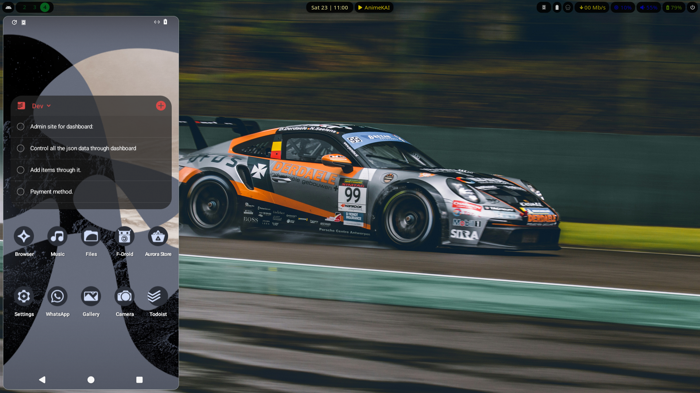
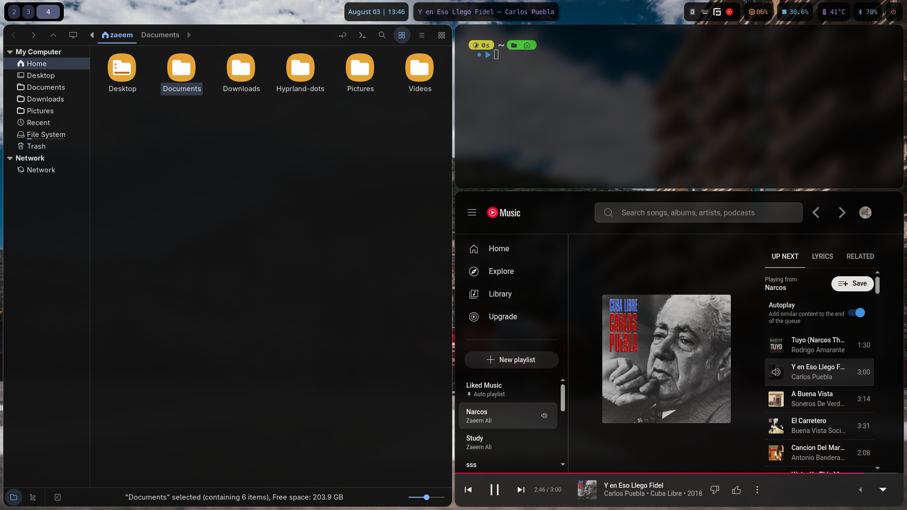
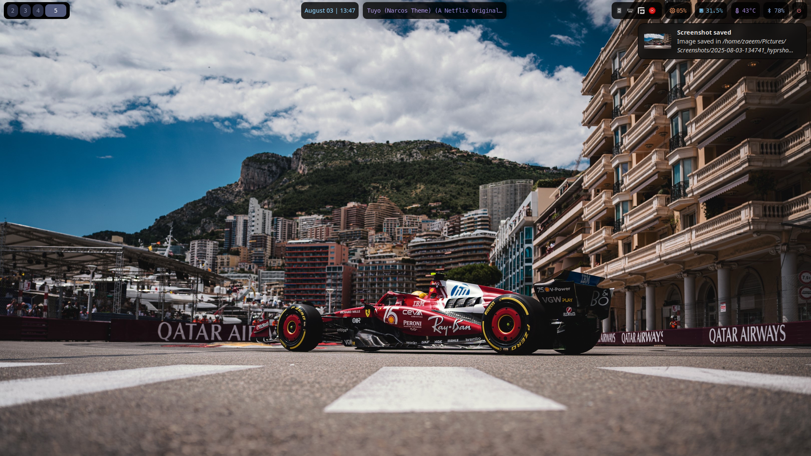
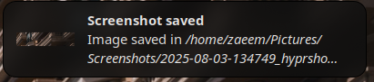
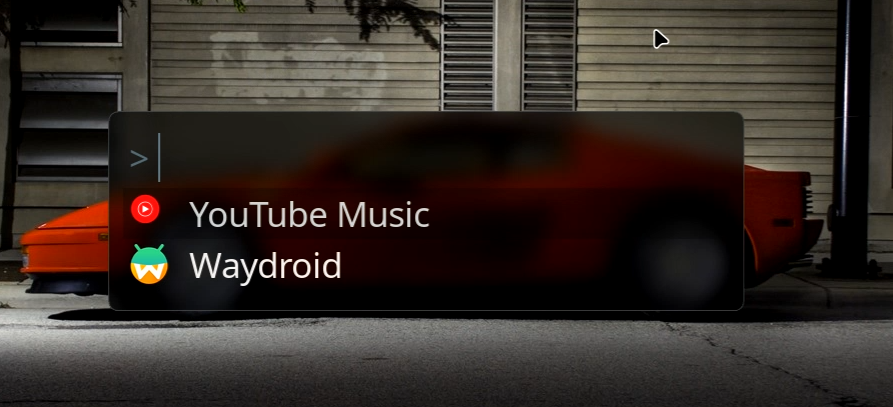
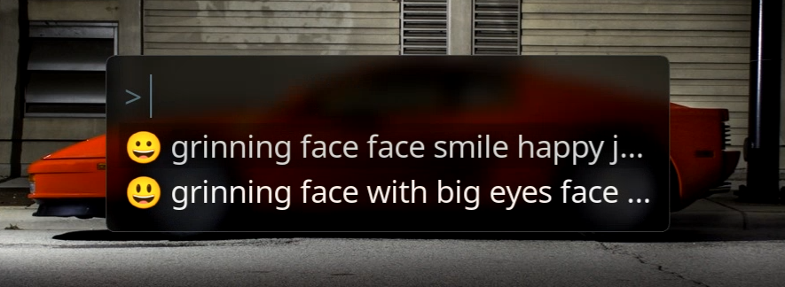
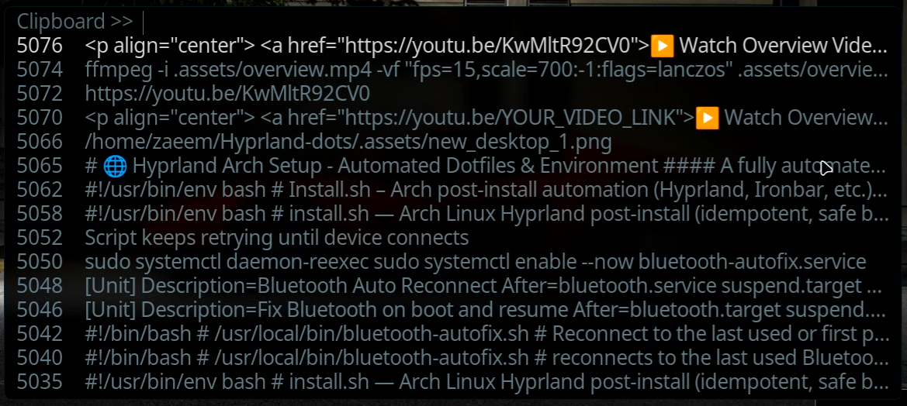

# 🌐 Hyprland Arch Setup - Automated Dotfiles & Environment

####  A fully automated script to install, configure, and personalize your Arch Linux with Hyprland and a minimal Wayland-only desktop.
#### This setup includes your custom dotfiles, essential utilities, UI themes, and personal preferences — with interactive choices for gaming setup.

## 🎥 Quick Overview
<p align="center">
  <a href="https://youtu.be/KwMltR92CV0">▶️ Watch Overview Video</a>
</p>


### 📸 Screenshots

<details> <summary>✨ New Desktop Setup</summary> <p align="center"> <br> <br>  </p> </details> <details> <summary>🖼️ Old Desktop Setup (Before Migration)</summary> <p align="center"> <br> <br> <br> <br>  </p> </details> <details> <summary>🧩 Ironbar UI Preview (New vs Old)</summary> <p align="center"> <br>  </p> </details> <details> <summary>🔔 Mako Notification Style</summary> <p align="center">  </p> </details>
<details> <summary>🖱️ Fuzzel Launcher Previews</summary>
<p align="center">
  <br>
  <br>
  
</p>
</details>
</br>


## 📦 What's Included?   
🔹 Fully scripted Arch install (no manual package entry)  
🔹 Wayland desktop with Hyprland  
🔹 Notifications via Mako.  
🔹 Status bar = Ironbar.   
🔹 Menus/launcher = Fuzzel.    
🔹 Audio stack = PipeWire + EasyEffects.

## 🗂️ Repo Structure
Hyprland-dots/  
├── .config/           → All configs (Hyprland, Ironbar, Fuzzel, Fish, etc.)  
├── .local/            → Local scripts, fish history, color schemes   
├── systemd/system/    → Custom system services (e.g. Bluetooth fixes)    
├── scripts/           → Helper scripts (installed to /usr/local/bin/)    
├── .assets/           → Screenshots + overview video   
├── install.sh         → Main install and setup script    
└── README.md          → You're here


## 📥 Installation
### 1. Boot into Arch with internet (TTY)

This script is intended for a fresh Arch Linux minimal install.

### 2. Clone the repo

```
git clone https://github.com/zaeemali272/Hyprland-dots.git                 
cd Hyprland-dots
```

### 3. Run the installer

```
chmod +x install.sh
./install.sh
```

### Alternate method
```
bash <(curl -s https://raw.githubusercontent.com/zaeemali272/Hyprland-dots/main/Install.sh)

```

The script is idempotent — safe to re-run, will back up existing configs unless --force is used.

<br>

## ⚡ Installer Flags  

You can control behavior with flags:  

| Flag                   | Description                                       |
|------------------------|---------------------------------------------------|
| `--extras`             | Install optional extra utilities (gparted, htop, ncdu, etc.) |
| `--gaming`             | Install gaming stack (Steam, Lutris, Wine, Gamemode, MangoHud) |
| `--dry-run`            | Show what would change (no writes)              |
| `--force`              | Overwrite existing files without backup (**dangerous**) |
| `--no-overwrite`       | Skip overwriting existing files                  |
| `--skip-aur`           | Skip AUR bootstrap & packages                   |
| `--no-icons`           | Skip OneUI icon theme installation              |
| `--enable-user-services` | Enable user services (Ironbar, etc.)         |
| `-y` or `--non-interactive` | Run without prompts (default yes to optional steps) |


## 🎮 Gaming Setup (Optional)

When prompted, you can install the gaming stack:

- **Lutris**  
- **Wine + Winetricks**  
- **Gamemode**  
- **Steam** (if you add it to `PACMAN_PKGS`)  
- **Game-related optimizations**  

If you say **no**, the related scripts/services are removed so your environment stays clean.

## 🔐 Autologin

The script can optionally set up autologin on **tty1** with:

```
/etc/systemd/system/getty@tty1.service.d/override.conf
```

It then starts Hyprland automatically via `config.fish`.


## ✅ Final Checks

Before finishing, the script runs:

- rfkill list → warns if Wi-Fi or Bluetooth are blocked.
- Ensures services are reloaded.
- Prints reboot recommendation.


## 🚀 After Installation

- Log in → you’ll land directly in Hyprland.
- Wallpapers managed with swww.
- Notifications via Mako.
- Status bar = Ironbar.
- Menus/launcher = Fuzzel.
- Audio stack = PipeWire + EasyEffects.
